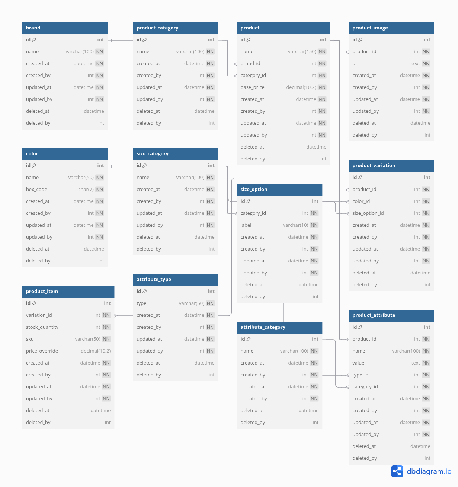

# E-Commerce Product Catalog Database Schema

This schema defines the core structure for an e-commerce product catalog system, designed with extensibility, auditability, and performance in mind. It includes tables for managing products, brands, categories, variations, attributes, and more.

## Key Features

- **Audit Fields**: Every table includes fields for tracking record creation, updates, and soft-deletion:
  - `created_at`, `updated_at`, `deleted_at` (timestamps)
  - `created_by`, `updated_by`, `deleted_by` (user IDs)

- **Product Structure**:
  - Products belong to both a `brand` and a `product_category`.
  - Each product can have multiple images and variations.
  - Variations are defined by combinations of `color` and `size_option`.

- **Attribute System**:
  - Products can have custom attributes linked to an `attribute_type` and `attribute_category`.

- **Inventory**:
  - Each product variation can have multiple `product_items` representing stock, SKU, and price override.

## Tables Included

- **`brand`**: Stores brand information with unique names.
- **`product_category`**: Defines categories for products.
- **`product`**: Contains core product data, including brand and category associations.
- **`product_image`**: Manages images associated with products.
- **`color`**: Lists color options for product variations.
- **`size_category`** and **`size_option`**: Define size structures for variations.
- **`product_variation`**: Represents combinations of color and size for specific products.
- **`product_item`**: Details individual SKUs tied to variations with stock data.
- **`attribute_type`** and **`attribute_category`**: Provide metadata structure for attributes.
- **`product_attribute`**: Stores custom attributes per product.

## Usage

This schema serves as a robust foundation for building scalable, feature-rich e-commerce platforms. It is compatible with tools like dbdiagram.io for easy visualization and collaboration.

## Notes

- Foreign keys to `created_by`, `updated_by`, and `deleted_by` are intended to reference a `users` table.
- Soft deletes are implemented via the `deleted_at` field; actual deletions are not enforced by the schema.
- Consider indexing frequently queried columns for improved performance.
- Ensure application-level input validation and sanitation to prevent SQL injection attacks.

## Getting Started

1. **Database Setup**: Use the provided SQL script to create the database schema.
2. **Integration**: Connect the schema with your application backend to manage e-commerce operations.
3. **Customization**: Extend the schema as needed to accommodate additional features or business logic.

## Contributing

Contributions are welcome! Please fork the repository and submit a pull request with your improvements.